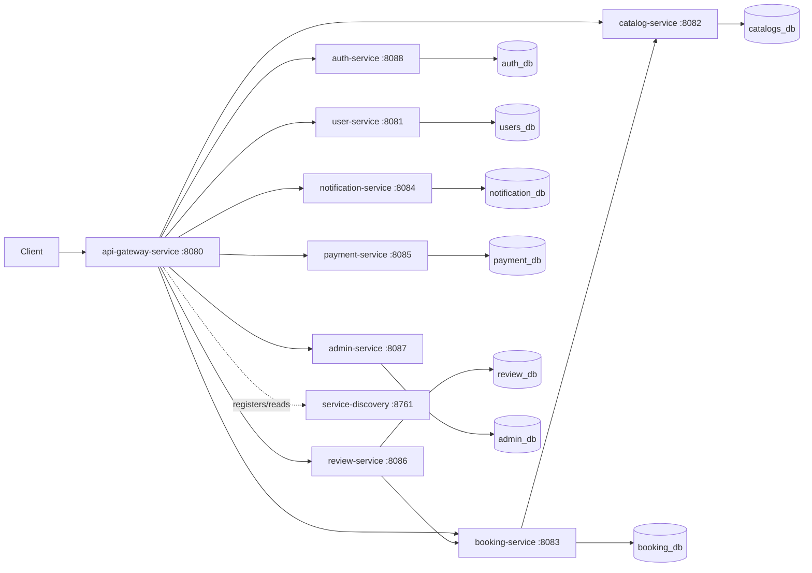

# Booking Hotel

Микросервисная система для бронирования отелей на Spring Boot. Репозиторий содержит отдельные сервисы для аутентификации, пользователей, каталога отелей, бронирований, уведомлений, отзывов, платежей, администрирования, API Gateway и Eureka Service Discovery.

## Состав системы

| Сервис | Порт | Назначение |
| --- | ---: | --- |
| [service-discovery](service-discovery/README.md) | 8761 | Eureka Server для регистрации и поиска сервисов |
| [api-gateway-service](api-gateway-service/README.md) | 8080 | единая точка входа через Spring Cloud Gateway |
| [auth-service](auth-service/README.md) | 8088 | регистрация, вход, refresh token, выпуск JWT |
| [user-service](user-service/README.md) | 8081 | профиль пользователя и статус аккаунта |
| [catalog-service](catalog-service/README.md) | 8082 | отели, типы номеров, поиск по каталогу |
| [booking-service](booking-service/README.md) | 8083 | бронирования и состав бронирования по типам номеров |
| [notification-service](notification-service/README.md) | 8084 | отправка и хранение уведомлений |
| [payment-service](payment-service/README.md) | 8085 | каркас сервиса платежей |
| [review-service](review-service/README.md) | 8086 | отзывы по завершенным бронированиям |
| [admin-service](admin-service/README.md) | 8087 | каркас административного сервиса |

## Технологии

- Java 17 для большинства сервисов, Java 21 для `api-gateway-service`
- Spring Boot, Spring Web, Spring Security, Spring Data JPA
- Spring Cloud Netflix Eureka и Spring Cloud Gateway
- PostgreSQL 16
- JWT через `jjwt`
- Lombok и MapStruct
- Maven Wrapper в каждом сервисе
- Docker и Docker Compose

## Архитектура

Система построена как набор независимых Spring Boot приложений. Каждый бизнес-сервис имеет собственную PostgreSQL базу данных. В Docker-режиме сервисы регистрируются в Eureka, а Gateway может проксировать их через discovery locator.



## Быстрый запуск через Docker Compose

```bash
docker compose up --build
```

После запуска доступны:

- Gateway: `http://localhost:8080`
- Eureka UI: `http://localhost:8761`
- auth-service: `http://localhost:8088`
- user-service: `http://localhost:8081`
- catalog-service: `http://localhost:8082`
- booking-service: `http://localhost:8083`
- notification-service: `http://localhost:8084`
- payment-service: `http://localhost:8085`
- review-service: `http://localhost:8086`
- admin-service: `http://localhost:8087`

Compose поднимает отдельную PostgreSQL базу для каждого сервиса и включает Eureka через переменные окружения `EUREKA_CLIENT_ENABLED=true` и `EUREKA_CLIENT_SERVICEURL_DEFAULTZONE=http://service-discovery:8761/eureka`.

Остановка:

```bash
docker compose down
```

Остановка с удалением данных PostgreSQL:

```bash
docker compose down -v
```

## Локальный запуск без Docker

Для локального запуска нужна Java, Maven Wrapper из каталога сервиса и локальный PostgreSQL. В `application.yaml` у клиентских сервисов Eureka по умолчанию отключена:

```yaml
eureka:
  client:
    enabled: false
```

Пример запуска сервиса:

```bash
cd auth-service
./mvnw spring-boot:run
```

Перед запуском бизнес-сервисов создайте соответствующие базы данных:

| База | Сервис |
| --- | --- |
| `auth_db` | auth-service |
| `users_db` | user-service |
| `catalogs_db` | catalog-service |
| `booking_db` | booking-service |
| `notification_db` | notification-service |
| `payment_db` | payment-service |
| `review_db` | review-service |
| `admin_db` | admin-service |

По умолчанию локальные настройки используют пользователя `malik` и пароль `12345678`. Для Docker эти значения также заданы в `docker-compose.yml`.

## Переменные окружения

| Переменная | Где используется | Назначение |
| --- | --- | --- |
| `JWT_SECRET` | auth, user, catalog, booking, notification, payment, review, admin | секрет подписи JWT, минимум 32 символа для HS256 |
| `JWT_EXPIRATION` | auth и защищенные сервисы | время жизни access token в миллисекундах |
| `JWT_REFRESH_EXPIRATION` | auth-service | время жизни refresh token |
| `CATALOG_SERVICE_URL` | booking-service | URL catalog-service для проверки типов номеров |
| `BOOKING_SERVICE_URL` | review-service | URL booking-service для проверки бронирования |
| `MAIL_HOST`, `MAIL_PORT`, `MAIL_USERNAME`, `MAIL_PASSWORD`, `MAIL_FROM` | notification-service | настройки SMTP |
| `SPRING_DATASOURCE_URL`, `SPRING_DATASOURCE_USERNAME`, `SPRING_DATASOURCE_PASSWORD` | бизнес-сервисы | подключение к PostgreSQL |
| `EUREKA_CLIENT_ENABLED`, `EUREKA_CLIENT_SERVICEURL_DEFAULTZONE` | gateway и бизнес-сервисы | регистрация в Eureka |

## Аутентификация

`auth-service` выпускает JWT. Защищенные сервисы ожидают заголовок:

```http
Authorization: Bearer <access-token>
```

Роли в системе: `USER`, `ADMIN`, `HOTEL_OWNER`, `MANAGER`.

## Основные API

Через прямые порты сервисов:

- `POST /api/auth/register`, `POST /api/auth/login`, `POST /api/auth/refresh`
- `GET /api/users`, `GET /api/users/find/{id}`, `POST /api/users/create-user`
- `GET /api/hotels/...`, `POST /api/hotels/add-hotel`, `GET /api/room-types`
- `POST /api/bookings`, `GET /api/bookings/{publicId}`, `PATCH /api/bookings/{publicId}/status`
- `POST /api/notifications/registration-success`
- `POST /api/reviews`, `PATCH /api/reviews`, `DELETE /api/reviews/{reviewId}`

Gateway использует discovery locator. В Docker-режиме маршруты доступны по service id, например:

```text
http://localhost:8080/auth-service/api/auth/login
http://localhost:8080/catalog-service/api/hotels/active
```

## Сборка и тесты

Сборка одного сервиса:

```bash
cd catalog-service
./mvnw clean package
```

Запуск тестов одного сервиса:

```bash
cd catalog-service
./mvnw test
```

Сборка Docker-образов выполняется через `docker compose up --build`. В Dockerfile тесты пропускаются командой `mvn -DskipTests clean package`.

## Текущий статус

Реализованы основные REST API для аутентификации, пользователей, каталога, бронирований, уведомлений и отзывов. `payment-service` и `admin-service` сейчас выглядят как каркасные сервисы: у них есть Spring Boot приложение, security и тестовый endpoint, но доменные платежные и административные API пока не описаны в коде.
