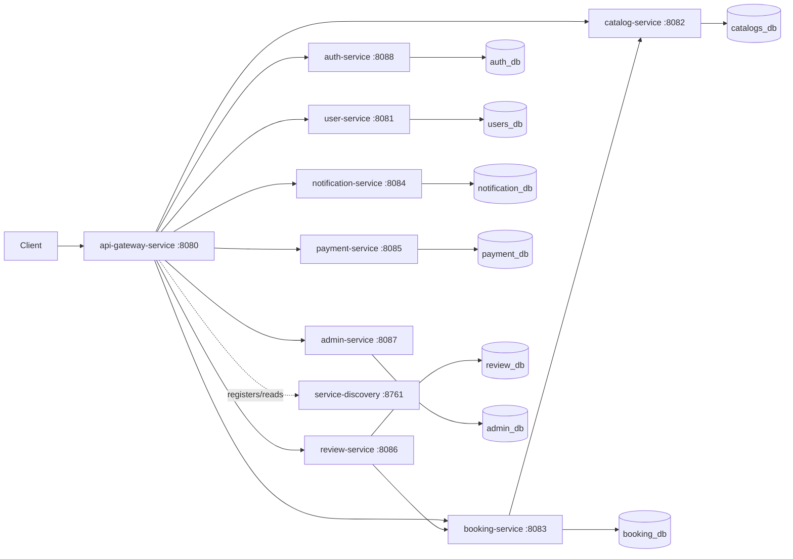

# Booking Hotel

Микросервисная система для бронирования отелей на Spring Boot. Репозиторий содержит отдельные сервисы для аутентификации, пользователей, каталога отелей, бронирований, уведомлений, отзывов, платежей, администрирования, API Gateway и Eureka Service Discovery.

## Состав системы

| Сервис | Порт | Назначение |
| --- | ---: | --- |
| [service-discovery](service-discovery/README.md) | 8761 | Eureka Server для регистрации и поиска сервисов |
| [api-gateway-service](api-gateway-service/README.md) | 8080 | единая точка входа через Spring Cloud Gateway |
| [auth-service](auth-service/README.md) | 8088 | регистрация, вход, refresh token, выпуск JWT |
| [user-service](user-service/README.md) | 8081 | профиль пользователя и статус аккаунта |
| [catalog-service](catalog-service/README.md) | 8082 | отели, типы номеров, поиск по каталогу |
| [booking-service](booking-service/README.md) | 8083 | бронирования и состав бронирования по типам номеров |
| [notification-service](notification-service/README.md) | 8084 | отправка и хранение уведомлений |
| [payment-service](payment-service/README.md) | 8085 | Kafka-платежи и тестовый платёжный адаптер |
| [review-service](review-service/README.md) | 8086 | отзывы по завершенным бронированиям |
| [admin-service](admin-service/README.md) | 8087 | каркас административного сервиса |

## Технологии

- Java 17 для большинства сервисов, Java 21 для `api-gateway-service`
- Spring Boot, Spring Web, Spring Security, Spring Data JPA
- Spring Cloud Netflix Eureka и Spring Cloud Gateway
- PostgreSQL 16
- JWT через `jjwt`
- Lombok и MapStruct
- Maven Wrapper в каждом сервисе
- Docker и Docker Compose

## Архитектура

Система построена как набор независимых Spring Boot приложений. Каждый бизнес-сервис имеет собственную PostgreSQL базу данных. В Docker-режиме сервисы регистрируются в Eureka, а Gateway может проксировать их через discovery locator.


```mermaid
flowchart LR
    Client["Client"] --> Gateway["api-gateway-service :8080"]
    Gateway --> Auth["auth-service :8088"]
    Gateway --> Users["user-service :8081"]
    Gateway --> Catalog["catalog-service :8082"]
    Gateway --> Booking["booking-service :8083"]
    Gateway --> Notifications["notification-service :8084"]
    Gateway --> Payments["payment-service :8085"]
    Gateway --> Reviews["review-service :8086"]
    Gateway --> Admin["admin-service :8087"]

    Auth --> AuthDb[("auth_db")]
    Users --> UserDb[("users_db")]
    Catalog --> CatalogDb[("catalogs_db")]
    Booking --> BookingDb[("booking_db")]
    Notifications --> NotificationDb[("notification_db")]
    Payments --> PaymentDb[("payment_db")]
    Reviews --> ReviewDb[("review_db")]
    Admin --> AdminDb[("admin_db")]

    Booking --> Catalog
    Reviews --> Booking
    Gateway -. registers/reads .-> Eureka["service-discovery :8761"]
```

## Быстрый запуск через Docker Compose

Подготовьте локальный файл окружения:

```bash
cp .env.example .env
chmod 600 .env
```

В `.env` заполните `PUBLIC_DOMAIN` (домен без `https://`), `POSTGRES_PASSWORD`
и `JWT_SECRET`. Пароль БД и JWT-секрет должны быть разными случайными значениями;
каждое можно сгенерировать командой `openssl rand -hex 32`.
`.env` исключён из Git. Compose не запускается при пустых обязательных значениях.
`JWT_SECRET` одинаков во всех сервисах, которые выпускают или проверяют JWT.

Перед запуском на сервере направьте DNS A/AAAA-записи домена на сервер и
откройте входящие TCP-порты 80 и 443. Caddy получает и обновляет HTTPS-сертификат,
перенаправляет HTTP на HTTPS и проксирует запросы к Gateway.
Настройка следует [документации Caddy](https://caddyserver.com/docs/automatic-https).

```bash
docker compose up --build
```

Публичный адрес системы: `https://<PUBLIC_DOMAIN>`.
Опубликованы только TCP-порты 80 и 443 reverse proxy. Kafka, Eureka, Gateway,
бизнес-сервисы и PostgreSQL доступны друг другу внутри Docker-сети.
Номера портов в таблице сервисов — внутренние порты контейнеров.
Данные сертификатов Caddy сохраняются в томах `caddy-data` и `caddy-config`.

Пример входа: `https://<PUBLIC_DOMAIN>/auth-service/api/auth/login`.
Для диагностики Kafka:

```bash
docker compose exec kafka /opt/kafka/bin/kafka-topics.sh --bootstrap-server kafka:9092 --list
```

Для локальной проверки HTTPS можно задать `PUBLIC_DOMAIN=localhost`.
Caddy использует локальный сертификат; браузеру потребуется доверие к локальному CA.
Для публичного сертификата нужен настоящий домен, направленный на сервер.

**Существующие данные PostgreSQL:** переменные `POSTGRES_USER` и `POSTGRES_PASSWORD`
инициализируют только новый том. При обновлении существующего стенда укажите
реального пользователя и пароль его БД; изменение `.env` не меняет пароль
существующей роли. Ротацию пароля выполните отдельно через PostgreSQL.
Не удаляйте тома ради смены пароля.
После смены `JWT_SECRET` ранее выданные токены перестают действовать.

Новые настройки портов и секретов применяются только после пересоздания контейнеров;
изменение файлов само по себе не закрывает порты уже запущенных контейнеров.

Compose поднимает отдельную PostgreSQL базу для каждого сервиса и включает Eureka через переменные окружения `EUREKA_CLIENT_ENABLED=true` и `EUREKA_CLIENT_SERVICEURL_DEFAULTZONE=http://service-discovery:8761/eureka`.

Остановка:

```bash
docker compose down
```

Остановка с удалением данных PostgreSQL, Kafka и сертификатов Caddy:

```bash
docker compose down -v
```

## Локальный запуск без Docker

Для локального запуска нужна Java, Maven Wrapper из каталога сервиса и локальный PostgreSQL. В `application.yaml` у клиентских сервисов Eureka по умолчанию отключена:

```yaml
eureka:
  client:
    enabled: false
```

Пример запуска сервиса:

```bash
cd auth-service
./mvnw spring-boot:run
```

Перед запуском бизнес-сервисов создайте соответствующие базы данных:

| База | Сервис |
| --- | --- |
| `auth_db` | auth-service |
| `users_db` | user-service |
| `catalogs_db` | catalog-service |
| `booking_db` | booking-service |
| `notification_db` | notification-service |
| `payment_db` | payment-service |
| `review_db` | review-service |
| `admin_db` | admin-service |

Локально передайте `POSTGRES_USER` (по умолчанию `booking_hotel`),
`POSTGRES_PASSWORD` и `JWT_SECRET` через окружение процесса.
Пароль и JWT-секрет не имеют значения по умолчанию.
Maven/Spring Boot не загружают корневой `.env` автоматически:
задайте переменные в терминале или конфигурации запуска IDE.

## Переменные окружения

| Переменная | Где используется | Назначение |
| --- | --- | --- |
| `JWT_SECRET` | auth, user, catalog, booking, notification, payment, review, admin | секрет подписи JWT, минимум 32 символа для HS256 |
| `PUBLIC_DOMAIN` | reverse-proxy | публичный домен для HTTPS |
| `POSTGRES_USER`, `POSTGRES_PASSWORD` | PostgreSQL и бизнес-сервисы | пользователь и обязательный пароль БД |
| `JWT_EXPIRATION` | auth и защищенные сервисы | время жизни access token в миллисекундах |
| `JWT_REFRESH_EXPIRATION` | auth-service | время жизни refresh token |
| `CATALOG_SERVICE_URL` | booking-service | URL catalog-service для проверки типов номеров |
| `BOOKING_SERVICE_URL` | review-service | URL booking-service для проверки бронирования |
| `MAIL_HOST`, `MAIL_PORT`, `MAIL_USERNAME`, `MAIL_PASSWORD`, `MAIL_FROM` | notification-service | настройки SMTP |
| `SPRING_DATASOURCE_URL`, `SPRING_DATASOURCE_USERNAME`, `SPRING_DATASOURCE_PASSWORD` | бизнес-сервисы | подключение к PostgreSQL |
| `EUREKA_CLIENT_ENABLED`, `EUREKA_CLIENT_SERVICEURL_DEFAULTZONE` | gateway и бизнес-сервисы | регистрация в Eureka |

## Аутентификация

`auth-service` выпускает JWT. Защищенные сервисы ожидают заголовок:

```http
Authorization: Bearer <access-token>
```

Роли в системе: `USER`, `ADMIN`, `HOTEL_OWNER`, `MANAGER`.

## Основные API

Пути ниже относятся к бизнес-сервисам; через Gateway добавьте service id перед путём:

- `POST /api/auth/register`, `POST /api/auth/login`, `POST /api/auth/refresh`
- `GET /api/users`, `GET /api/users/find/{id}`, `POST /api/users/create-user`
- `GET /api/hotels/...`, `POST /api/hotels/add-hotel`, `GET /api/room-types`
- `POST /api/bookings`, `GET /api/bookings/{publicId}`, `PATCH /api/bookings/{publicId}/status`
- `POST /api/notifications/registration-success`
- `POST /api/reviews`, `PATCH /api/reviews`, `DELETE /api/reviews/{reviewId}`

Gateway использует discovery locator. В Docker-режиме маршруты доступны по service id, например:

```text
https://<PUBLIC_DOMAIN>/auth-service/api/auth/login
https://<PUBLIC_DOMAIN>/catalog-service/api/hotels/active
```

## Сборка и тесты

Сборка одного сервиса:

```bash
cd catalog-service
./mvnw clean package
```

Запуск тестов одного сервиса:

```bash
cd catalog-service
./mvnw test
```

Сборка Docker-образов выполняется через `docker compose up --build`. В Dockerfile тесты пропускаются командой `mvn -DskipTests clean package`.

## Текущий статус

Реализованы основные REST API для аутентификации, пользователей, каталога, бронирований, уведомлений и отзывов. Каталог обрабатывает резервирование через Kafka, платёжный сервис хранит платежи и поддерживает явно тестовую оплату. `admin-service` остаётся каркасом. Реальный платёжный провайдер ещё не подключён.

## Поток бронирования

1. Клиент передаёт hotelId, userId, даты и rooms с roomTypeId/quantity. Цена берётся из каталога, число ночей считается сервером. Старые поля pricePerNight/nights допустимы для совместимости, но игнорируются.
2. Booking сохраняет NEW и команды в транзакционном outbox. Каталог атомарно резервирует все номера на каждый день интервала [заезд, выезд), либо отклоняет весь запрос. Повторные команды не резервируют второй раз.
3. ROOM_RESERVED переводит бронь в PAYMENT_PENDING и создаёт команду оплаты. Отказ резервирования переводит её в CANCELLED.
4. PAYMENT_SUCCEEDED переводит бронь в PAID. Администратор подтверждает её через PATCH статуса до CONFIRMED. PAYMENT_FAILED переводит её в CANCELLED и освобождает номера.

Сообщения имеют eventType и payload. Изменения БД и исходящие сообщения фиксируются вместе; доставка outbox повторяется после сбоя. Доставка допускает повторы, обработчики бизнес-переходов идемпотентны.
Состав созданной брони неизменяем, поскольку команда резервирования уже сформирована. DELETE неоплаченной брони отменяет её, сохраняет историю и освобождает резерв; для оплаченной нужен отдельный процесс возврата, поэтому DELETE отклоняется.

Тестовая оплата включается **только для разработки**: DEMO_PAYMENT_ENABLED=true. Получить платёж можно через GET /payment-service/api/payments?bookingPublicId=..., затем POST /payment-service/api/payments/{paymentId}/demo с {"outcome":"SUCCEEDED"} или {"outcome":"FAILED"}. Владельцу доступны только его платежи. Это не списание денег; по умолчанию тестовый endpoint выключен.

## Сквозная локальная проверка

Нужны Docker Desktop, Python 3 и Java 21+ для локальной сборки gateway. Существующие контейнеры и тома основного проекта не меняются. Тест создаёт отдельный проект bookinghotel-flow-check, тестовые аккаунты/брони и открывает только 127.0.0.1:18080. Не используйте тестовые учётные данные в настоящем окружении.

```bash
for service in auth-service catalog-service booking-service payment-service api-gateway-service service-discovery; do
  (cd "$service" && ./mvnw -q -DskipTests package) || exit 1
done
PUBLIC_DOMAIN=localhost POSTGRES_USER=flow_test POSTGRES_PASSWORD=local-flow-test-only-password \
JWT_SECRET=local-flow-test-only-signing-key-not-for-production-64 \
docker compose -p bookinghotel-flow-check --env-file .env.example \
  -f docker-compose.yml -f deploy/compose.flow-test.yml up -d --no-build \
  kafka service-discovery auth-service catalog-service booking-service payment-service api-gateway-service
python3 deploy/check-flow.py
```

Тест проверяет регистрацию/вход и каталог через gateway, защиту цены, резервирование/отказ, тестовую оплату, подтверждение, конкурентные заявки, повтор команды, сбой Kafka, перезапуск с сохранением данных, dump и восстановление БД. Он не проверяет публичный TLS, реальное списание или нагрузочную готовность. Для удалённой проверки нужен адрес сервера и доступ к нему.

## Резервное копирование

Разовый backup всех восьми БД: bash deploy/backup-databases.sh. Скрипт создаёт закрытую папку backups/<UTC-время>, custom-format dumps и SHA256SUMS; пароль берётся внутри контейнера, не выводится. Можно передать нужные БД аргументами. При ошибке остаётся .partial, скрипт завершается с ненулевым кодом.

Для регулярного backup после запуска всех БД:

```bash
docker compose --profile backup up -d database-backups
docker compose logs --tail=20 database-backups
```

Сервис делает копию при запуске и каждые 86400 секунд (BACKUP_INTERVAL_SECONDS). Копии хранятся в томе database-backups-data. Только папки с COMPLETE и корректными SHA256SUMS считаются полностью готовыми. Копии независимых БД делаются последовательно, не являются общим атомарным снимком с Kafka; перед полным disaster-recovery следует остановить запись и сверить незавершённые брони/платежи. Автоматическое удаление не настроено: задайте политику хранения и контроль свободного места.

Для выгрузки копий: docker compose cp database-backups:/backups ./backup-export. Настройте зашифрованную передачу на другой сервер/хранилище: локальный том **не защищает от потери сервера**. Адрес внешнего хранилища в проекте не задан. Backup содержит персональные данные и хеши паролей — не коммитьте и не публикуйте его.

Восстанавливайте сначала в новую пустую БД, не поверх рабочей: pg_restore -U <user> -d <new_database> --no-owner --no-acl --exit-on-error < booking-db.dump. Проверяйте данные и ограничения до переключения сервиса. Сквозной тест выполняет такое восстановление в отдельную тестовую БД; существующие данные не удаляет. Не используйте docker compose down -v для штатного перезапуска.
